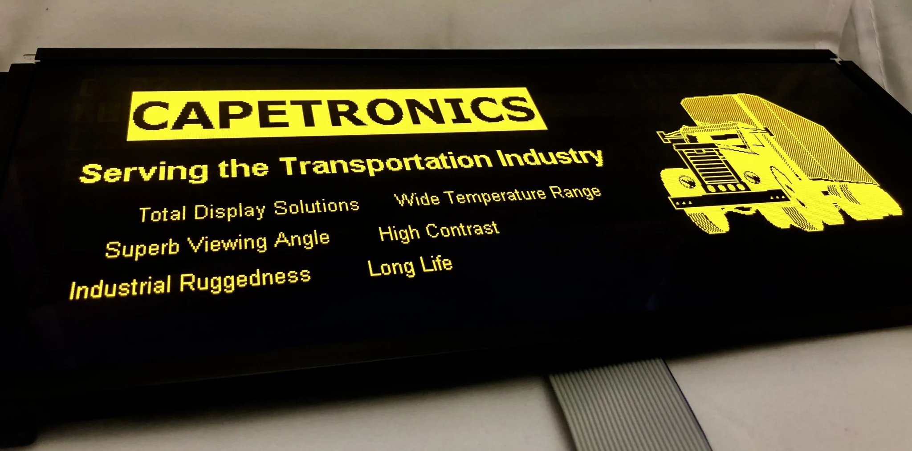

# Controlling an EL640.200-SK with an RP2040

## Introduction

## Project Scope & Structure

## Hardware Setup

## Software Implementation

### Memory Consumption

**Frame Buffer**
640 x 200 @ 1bpp -> 640 * 200 * 1/8 = 16KBytes

## Testing

## Results

## Conclusion
